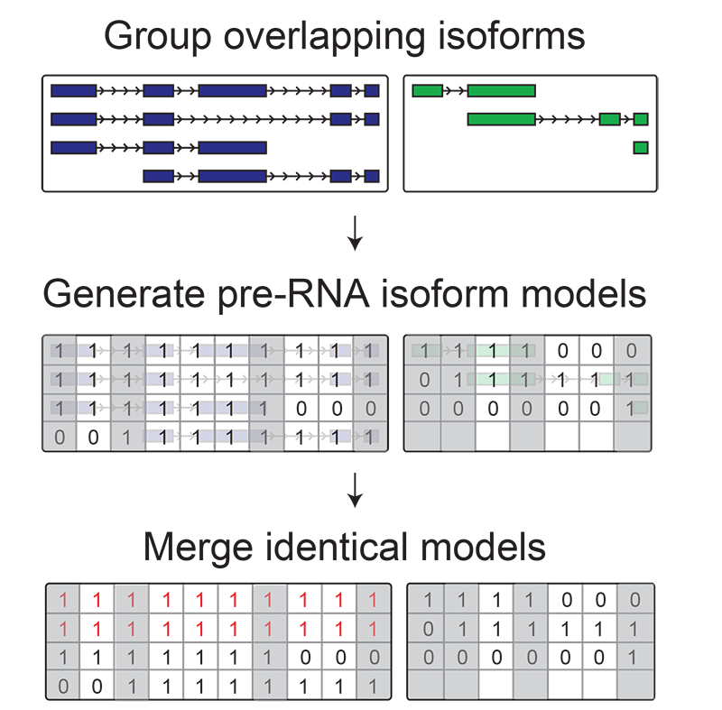
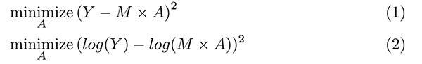
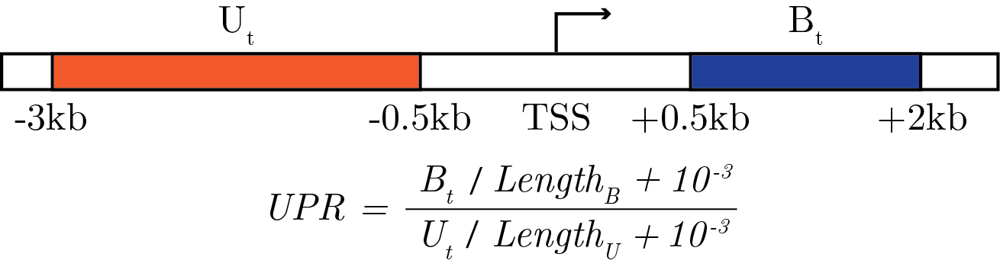

<!-- badges: start -->
[](https://travis-ci.org/CshlSiepelLab/DENR)
[](https://codecov.io/gh/CshlSiepelLab/DENR?branch=master)
<!-- badges: end -->

# Quantifying nascent RNA sequencing data with transcript level resolution

## Installation
### DENR package
Package can be installed with the following line of code:

```
devtools::install_github("CshlSiepelLab/DENR")
```

### Tensorflow and Keras
The TSS identification method uses the deep learning framework `Keras` and `Tensorflow`.
Only tensorflow 2.0 or greater is supported. Note that the version of the R `tensorflow`
package is not the same as the python versions it is using under the hood. To check it
run.
```
tensorflow::tf_config()

```

Instructions on installing tensorflow and keras from R can be found
[here](https://tensorflow.rstudio.com/reference/keras/install_keras/).


## Overview
DENR performs annotation based transcript level quantification on
nascent RNA sequencing data. Although it was developed on PRO-seq data it should be
generally applicable to any nascent sequencing dataset which has been processed such that
each read is represented as a single count representing the 3' end of the transcript being
synthesized. For a pipeline to process PRO-seq data in this manner see the Danko Lab's
PRO-seq 2.0 pipeline [here](https://github.com/Danko-Lab/proseq2.0).

## Application tutorial

For details on running the DENR method please see the Introduction vignette. It can
be built locally or viewed online [here](https://rpubs.com/ndukler/622610).

## Methodology
The DENR method explains the observed polymerase density as a weighted mixture of
the underlying transcript annotations. The algorithm is outlined as follows ("\*" steps
are optional):

1. Construct a unique set of pre-RNA isoform models from annotations
2. Produce non-uniform polymerase density profile*
3. Predict inactive transcript start sites (TSS)*
4. Estimate pre-RNA isoform abundances

### Transcript model generation
After being provided annotations, DENR constructs a set of models corresponding
to each mature RNA isoform and reduces them to a set of unique pre-RNA isoform models. Isoforms
with highly similar 5' and 3' ends are often indistinguishable from each other when looking at
nascent RNA sequencing data. The degree to which this occurs depends on the degree of
granularity in the isoform models as specified by the user and the length of the
5' and 3' regions that are masked for each isoform. We recommend masking roughly +/-
1kb for all isoforms as initiation and especially termination are messy processes
producing highly noisy signals and thus ignoring them generally improves the performance
of DENR. DENR then reduces these non-identifiable isoforms to a shared
model. This process is outlined in the figure below.

<p align="center">
  
</p>

### Quantification
pre-RNA isoforms are quantified by minimizing the difference between the polymerase density
predicted by isoform models (M) weighted by their abundances (A) vs the observed
polymerase density(Y). There are two different cost functions, one based on the raw
counts (1), the other based on the log counts (2).

<p align="center">
  
</p>

The default model is the one using the log counts as the errors are more gaussian-like
and thus a better match the assumption of normally distributed errors implied by the
sum-of-squares cost function.

### Optional: TSS filtering
TSS filtering is done by providing the fitting step with a list of inactive TSS. The user
may create this list however they want, but we do include an deep learning model trained
to detect active TSS in the DENR package. In order to run this model `keras` must
be installed on your machine. As this is a fairly simple convolutional model it runs fine
on a CPU, with no need for GPU acceleration.

#### Technical notes
**Technical Note 1:** If two or more transcripts share the same model but at least one is
not marked as inactive, the model will be presumed to be active and allowed to have a
non-zero abundance value during fitting.

**Technical Note 2:** Given that the TSS predictor misses some active TSS with abnormal
polymerase density patterns there is an additional heuristic that looks for unexplainable
high density polymerase regions. It does this by calculating and upstream polymerase
ratio (UPR) using the regions indicated in the schematic below:

<p align="center">
  
</p>

If the UPR of a transcript *t* is greater than or equal to 10, and there are no other
active transcripts within 5Kb upstream or 6Kb downstream of the TSS of *t*, then *t* is
allowed to be active during the fitting step.

### Optional: Shape profile
It is know that polymerase density varies as the polymerase moves the body of the gene.
Although we already recommend masking out the head and tail regions of the isoforms to
avoid the large spikes of polymerase density typically viewed there, we provide another
tool to account for the more subtle variation caused by the acceleration. Using
heuristic methods to select isoforms that are explained by the vast majority of polymerase
density at their locus, DENR constructs an empirical model for relative polymerase
densities in the gene body. The profile is then calculated using a loess fit that maps
position within the gene on a rescaled [0, 1] range to the observed polymerase density,
normalized median density in the gene body. Relative positions within the gene body are
calculated such that regions close to the head and tail of the gene where absolute
position is important are scaled identically across genes (e.g. head 5kb -> [0, 0.2] and
tail 5kb -> [0.8, 1]), and the midsection of each gene is scaled to fit into the
remaining space on the [0, 1] interval. Short genes are handled specially to just use the
applicable part of the linearly scaled regions. Once this shape profile has been
calculated it can be used to adjust the isoform models so that they do not assume
uniform polymerase density throughout the gene body.
